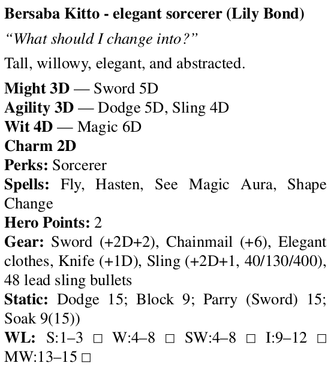

Mini Six Character Cost Calculator and Formatters
@@@@@@@@@@@@@@@@@@@@@@@@@@@@@@@@@@@@@@@@@@@@@@@@@

This contains programs for reading YAML_ and JSON_ files representing
`Mini Six` (M1_, M2_) characters and calculating their cost as
starting characters, as well as for producing output in
reStructuredText_ (for typesetting or converting to HTML) and roff_
(for typesetting using a program such as groff_).

`Mini Six` is an OpenD6 (O1_, O2_, O3_) derived tabletop roleplaying
game. 

.. _JSON: https://www.json.org/json-en.html
.. _YAML: https://yaml.org/
.. _M1: http://www.antipaladingames.com/p/mini-six.html
.. _M2: https://www.drivethrurpg.com/product/144558/Mini-Six-Bare-Bones-Edition
.. _reStructuredText: https://docutils.sourceforge.io/rst.html
.. _roff: https://en.wikipedia.org/wiki/Roff_(software)
.. _O1: https://en.wikipedia.org/wiki/D6_System#Purgatory_Publishing_era
.. _O2: https://opend6.fandom.com/wiki/OpenD6
.. _O3: http://opend6project.org/
.. _CHICKEN Scheme: https://call-cc.org/
.. _groff: https://www.gnu.org/software/groff/

The primary programs are all written in `CHICKEN Scheme`_:

• ``sm6`` - read YAML or JSON and calculate cost as a starting
  character.
• ``sm6fmt`` - alternate version that uses the CHICKEN Scheme ``fmt``
  egg for ouput.
• ``sm6rst`` - read YAML or JSON and output formatted character stats
  in reStructuredText_ for inclusion into other documents, converting
  to HTML, or typesetting.
• ``sm6troff-ms`` - read YAML or JSON and output formatted character
  stats in roff format for the ``ms`` macros, for inclusion into other
  documents or typesetting.

There are several implementations of the character cost calculating
program in other programming languages which I wrote in other
languages as an exercise in comparing how they dealt with JSON and/or
YAML.  None of them are as complete as the Scheme versions.  The
OCaml_ version, ``om6.ml``, was never completed.

.. _OCaml: https://ocaml.org/

A typical Mini Six character expressed in YAML_ looks like this:

.. code::

   - Name: Bersaba Kitto
     Archetype: elegant sorcerer
     Quote: What should I change into?
     Description: Tall, willowy, elegant, and abstracted.
     Player: Lily Bond
     Might: [3D, [Sword, 5D]]
     Agility: [3D, [Dodge, 5D], [Sling, 4D]]
     Wit: [4D, [Magic, 6D]]
     Charm: [2D]
     Static: [[Dodge, 15], [Block, 9], ['Parry (Sword)', 15], [Soak, 9(15))]]
     Perks: [[Sorcerer, 3D]]
     Gear:
       - Sword (+2D+2)
       - Chainmail (+6)
       - Elegant clothes
       - Knife (+1D)
       - Sling (+2D+1, 40/130/400), 48 lead sling bullets
     Spells:
       - Fly
       - Hasten
       - See Magic Aura
       - Shape Change
     Hero_Points: 2
     Notes: |
       Notes
       ~~~~~

       • One of your spells is a game breaker, I think.
       • Your sling is stored coiled up in an elegantly decorated pouch
         that also holds 3 pounds of lead sling bullets.
       • Your chainmail has multicolored links that make up a pattern.
   
The reStructuredText output from that looks like:

.. code:: reStructuredText

   Bersaba Kitto - elegant sorcerer (Lily Bond)
   --------------------------------------------

   *“What should I change into?”*

   Tall, willowy, elegant, and abstracted.

   | **Might 3D** — Sword 5D
   | **Agility 3D** — Dodge 5D, Sling 4D
   | **Wit 4D** — Magic 6D
   | **Charm 2D**
   | **Perks:** Sorcerer
   | **Spells:** Fly, Hasten, See Magic Aura, Shape Change
   | **Gear:** Sword (+2D+2), Chainmail (+6), Elegant clothes, Knife (+1D), Sling (+2D+1, 40/130/400), 48 lead sling bullets
   | **Static:** Dodge 15; Block 9; Parry (Sword) 15; Soak 9(15))
   | **Hero Points:** 2
   | **WL:** S:1–3 □ W:4–8 □ SW:4–8 □ I:9–12 □ MW:13–15 □

   Notes
   ~~~~~

   • One of your spells is a game breaker, I think.
   • Your sling is stored coiled up in an elegantly decorated pouch
     that also holds 3 pounds of lead sling bullets.
   • Your chainmail has multicolored links that make up a pattern.

The command

.. code:: bash

   sm6troff-ms -s -2 -H test-files/Bersaba-Kitto.yaml | groff -k -Tpdf -ms

produces PDF output that looks like this:

These programs can also be used for Mini Six derived or related RPGs
such as the `Breachworld RPG`_.

.. _Breachworld RPG: https://www.drivethrurpg.com/product/141188/Breachworld-RPG
